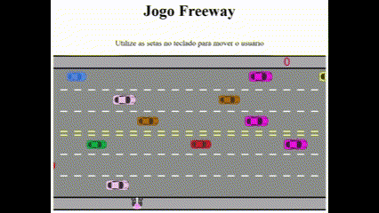

# Jogo Freeway

## 📖 Descrição

Esta aplicação é um jogo cujo objetivo é atravessar um personagem (um boneco) até o outro lado da rua sem ser atingido pelos carros. A cada travessia bem-sucedida, o jogador acumula pontos, mas cada colisão com um veículo resulta na diminuição desses pontos. O projeto foi desenvolvido durante o curso de JavaScript na Alura.

## Objetivo
° Levar o personagem até o outro lado da rua e acumular pontos.

## 🛠️ Tecnologias

° 
° 
° 

## ⌛ Inicialização

Esse projeto foi desenvolvido em ambiente Windows, utilizando a ferramenta VSCode e as tecnologias citadas anteriormente. 
A preparação do ambiente consiste em instalar a ferramenta, instalar e habilitar a extensão 'p5.vscode'.

## 🌎 Implementações Futuras

° Adicionar quantidade de vidas

## 🔎 Status do Projeto
Concluído
